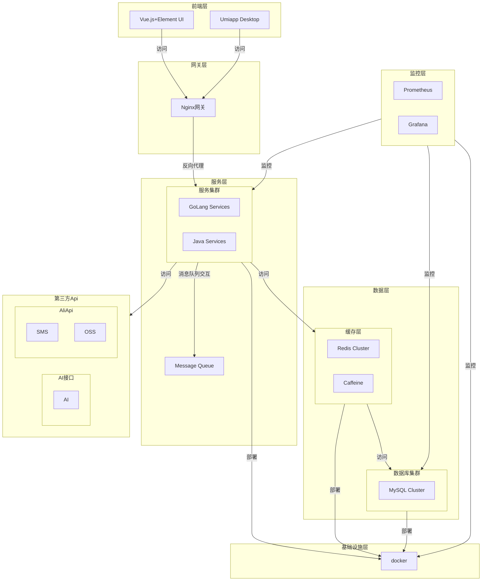
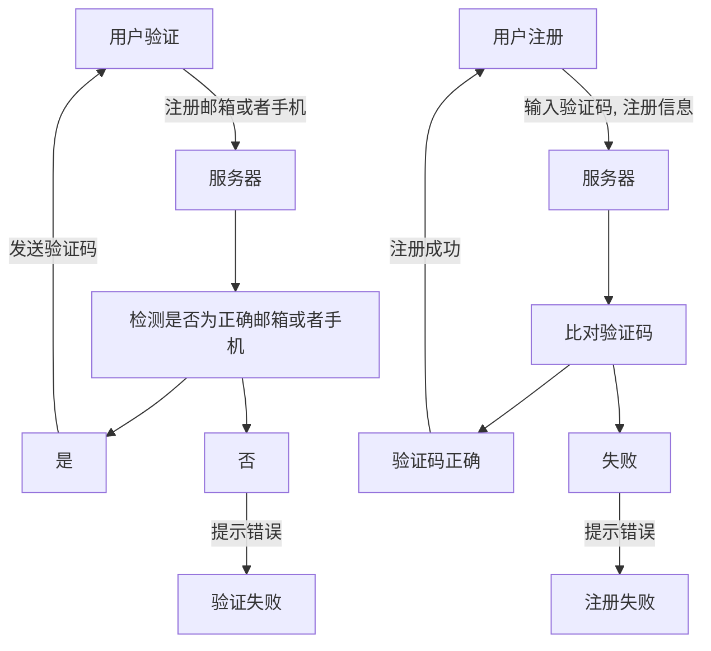
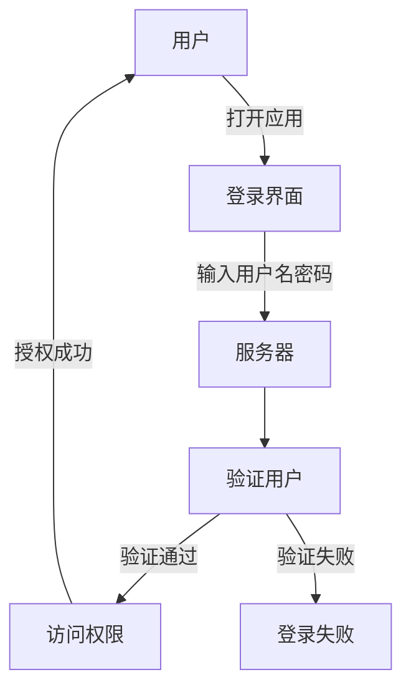
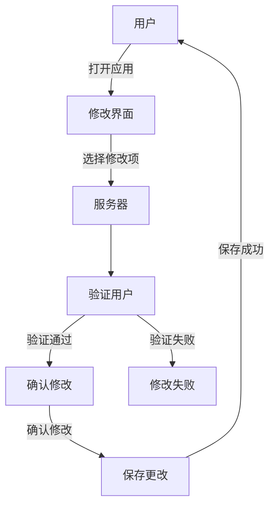
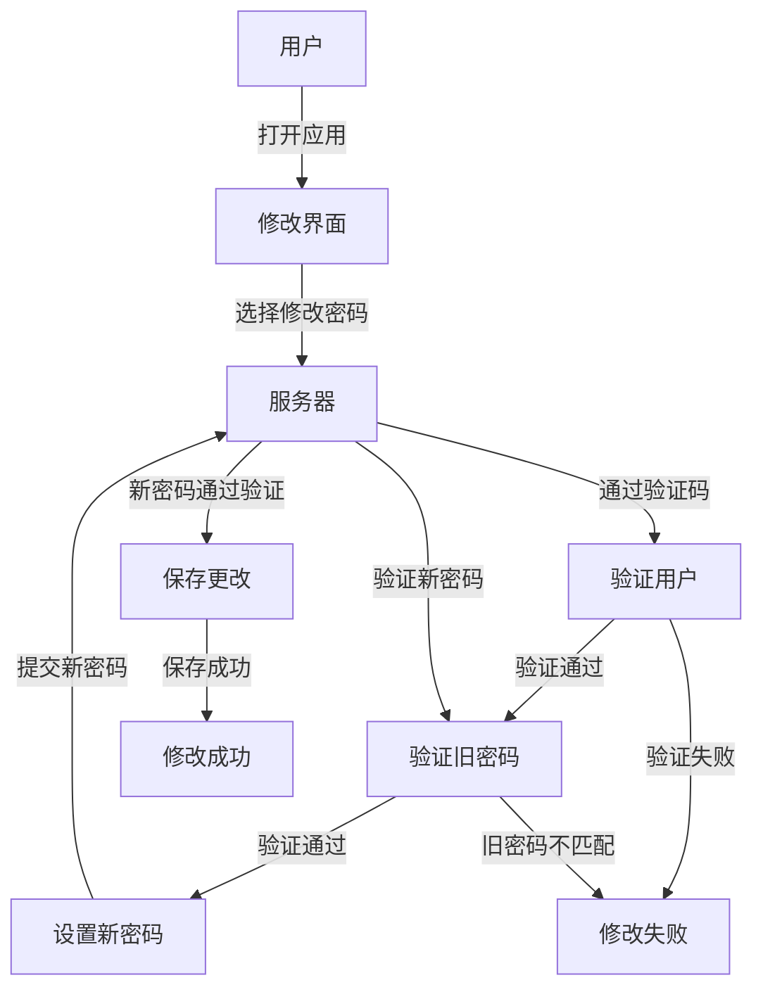
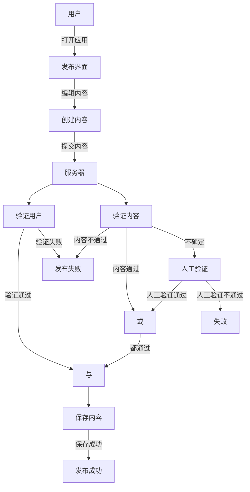
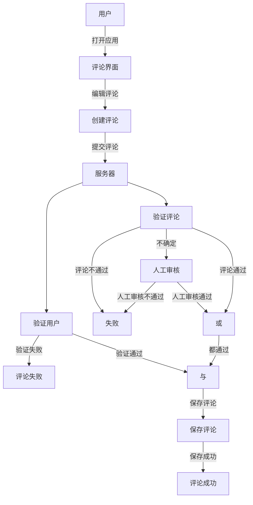
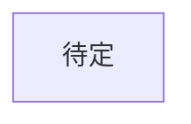

# 分模块的社交App

- 项目名称：朋有
- 项目目标：通过不同的社区吸引有不同爱好的人来一起交流，聊天，成为朋友，帮助找到与自己性情匹配的伙伴
- 团队成员：Napbad

backend: [https://github.com/Napbad/pengyou-backend]

## 项目需求分析

1. 核心功能需求

- 用户模块
    - 权限
        - 包括注册，登录，登出，用户找回密码
        - 注册
            - 使用邮箱或者手机注册
                - 支持邮箱或手机注册，邮箱验证通过IMAP/POP协议，短信验证集成阿里云服务。
                - 邮箱与手机需进行双重验证确保安全性。  
        - 登录
            - 多种登录方式支持：用户名、邮箱、手机号配以密码或验证码。
            - 成功登录后，系统返回JWT令牌用于后续请求的身份验证。
        - 登出
            - 清除会话和本地存储的JWT令牌，确保用户隐私安全。
        - 找回密码
            - 通过手机或邮箱发送验证码，用户验证后可重置密码，同样需要二次验证
    
    - 资料
        - 人格类型，用户名，用户uid，头像，个人简介，性别，生日，地区，职业，职位，教育，学校，专业，头像，标签
        - 用户可编辑个人信息，包括但不限于：
            - 人格类型
            - 用户名
            - 头像
            - 个人简介
            - 性别
            - 生日
            - 地区
            - 职业
            - 职位
            - 教育背景
            - 学校
            - 专业
            - 标签
    - 支持一对一聊天，消息类型包括：
        - 文本
        - 图片
        - 视频
        - GIF
        - 文件传输
        - 聊天记录保存，用户可随时查看历史对话。

    - 用户可以添加、删除好友，以及通过关键词搜索添加好友。
- 社区模块
    - 发布
        - 用户可以发布视频、文本内容至社区。
        - 内容发布前需进行审核（自动检测敏感词），确保符合社区准则。
    - 评论
        - 用户对帖子进行评论，支持多级回复。
        - 内容发布前需进行审核（自动检测敏感词），确保合法合规
        - 评论管理，包括举报、删除不当评论。
    - 分区
        - 社区分为多个主题区域，便于用户根据兴趣浏览和参与讨论。
    - 信息管理
        - 用户可编辑、删除自己的帖子，评论。
- 搜索
    - 实现用户、帖子、社区与评论的关键词、特征搜索功能。
    - 搜索结果按相关性排序，提供筛选和过滤选项。

- 后台管理
    - 查看、编辑、禁用用户账户。
    - 监控用户行为，处理违规账号。
    - 审核用户发布的帖子和评论，确保内容合规。
    - 接受，处理举报
    - 人工复审争议内容（自动检测敏感词没有检测到的）。
    - 监控系统性能，及时发现并解决问题。

2. 可选功能需求
- 好友分组
- 群组
    - 加入，退出群组，创建群组，管理群组信息（管理员），邀请成员
- 举报不良信息
- 系统配对，推荐
- 关注
- 即时消息提醒
- 评论通知
- 动态更新通知
- 微信，QQ登录等第三方登录
- 用户认证
- 附近
- 即时闲聊
- 即时休闲小游戏
- 接入AI<>

## 项目技术选型

1. 版本控制 - Git，GitHub
- GitHub用于版本控制，管理代码，协作开发

2. 后端服务 - GoLang + gin + gorm + MySQL + Java + SpringBoot + Redis + SpringCloud + Nacos + Jimmer + RabbitMQ
- 实现API服务、服务架构、数据处理服务
- go 用于实现并发高的环境，如搜索，聊天
- java 用于实现高可用的服务，如用户账户管理，管理员
- 分布式MySQL集群，Redis集群，用于存储数据，同时Redis实现分布式锁
- Nacos 用于服务注册与发现，配置管理，服务治理
- RabbitMQ 用于异步处理，消息队列

3. 前端
-  Web(Vue.js + element-ui) Nginx
    - 易于上手，高度可组合的组件系统，高效的虚拟DOM， 构建用户界面，实现SPA（单页应用）
- 桌面应用 Uniapp(electron)
    - 使用HTML, CSS和JavaScript构建跨平台的桌面应用，开发桌面客户端

4. 工具与库

  - **Prometheus & Grafana**: 监控系统和应用的健康状况
  - **ELK Stack**: 收集、分析、存储日志数据(待定)
  - **Jenkins**: 持续集成和持续部署（CI/CD）(待定)

## 数据库表

1. 用户表 (user)

| 字段名          | 类型                        | 描述               |
| --------------- | --------------------------- | ------------------ |
| id              | UNSIGNED INT AUTO_INCREMENT | 用户唯一标识符     |
| username        | VARCHAR(50)                 | 用户名             |
| password        | VARCHAR(64)                 | 加密后的密码       |
| email           | VARCHAR(50)                 | 邮箱地址           |
| phone           | VARCHAR(20)                 | 手机号码           |
| login_time      | TIMESTAMP                   | 上次登录时间       |
| created_at      | TIMESTAMP                   | 创建时间           |
| updated_at      | TIMESTAMP                   | 更新时间           |
| delete_at       | TIMESTAMP                   | 删除时间           |
| status          | SMALLINT                    | 0 未激活，1 激活   |
| heart_beat_time | TIMESTAMP                   | 心跳时间           |
| client_ip       | VARCHAR(50)                 | 客户端IP地址       |
| is_logout       | TINYINT                     | 0 未登出，1 已登出 |
| log_out_time    | TIMESTAMP                   | 登出时间           |
| device_info     | VARCHAR(255)                | 设备信息           |
| created_person  | UNSIGNED INT                | 创建人             |
| updated_person  | UNSIGNED INT                | 更新人             |

2. 用户资料表 (user_profile)

| 字段名         | 类型         | 描述                          |
| -------------- | ------------ | ----------------------------- |
| id             | UNSIGNED INT | 用户资料唯一标识符            |
| user_id        | UNSIGNED INT | 用户ID （user.id）            |
| display_name   | VARCHAR(50)  | 显示名称                      |
| avatar_id      | VARCHAR(255) | 头像URL                       |
| bio            | VARCHAR(255) | 个人简介                      |
| gender         | TINYINT      | 性别 0 male 1 female 2 others |
| birthday       | DATE         | 生日                          |
| location       | VARCHAR(100) | 地区                          |
| occupation     | VARCHAR(100) | 职业                          |
| education      | VARCHAR(100) | 教育背景                      |
| school         | VARCHAR(100) | 学校                          |
| major          | VARCHAR(100) | 专业                          |
| company        | VARCHAR(100) | 公司                          |
| Position       | VARCHAR(100) | 职位                          |
| website        | VARCHAR(255) | 个人网站                      |
| created_at     | TIMESTAMP    | 创建时间                      |
| updated_at     | TIMESTAMP    | 更新时间                      |
| delete_at      | TIMESTAMP    | 删除时间                      |
| created_person | UNSIGNED INT | 创建人                        |
| updated_person | UNSIGNED INT | 更新人                        |

3. 用户标签表（tag）

| 字段名      | 类型                        | 描述           |
| ----------- | --------------------------- | -------------- |
| id          | UNSIGNED INT AUTO_INCREMENT | 标签唯一标识符 |
| name        | varchar(63)                 | 标签信息       |
| description | varchar(255)                | 标签描述       |

4. 用户标签对应表 (user_tag_mapping)

| 字段名  | 类型                                                   | 描述       |
| ------- | ------------------------------------------------------ | ---------- |
| id      | UNSIGNED INT AUTO_INCREMENT PRIMARY KEY AUTO_INCREMENT | 唯一标识符 |
| user_id | UNSIGNED INT AUTO_INCREMENT                            | 用户id     |
| tag_id  | UNSIGNED INT AUTO_INCREMENT                            | 标签id     |

5. 用户好友关系表 (user_friend)

| 字段名         | 类型                                    | 描述                                |
| -------------- | --------------------------------------- | ----------------------------------- |
| id             | UNSIGNED INT PRIMARY KEY AUTO_INCREMENT | 唯一标识符                          |
| user_id        | UNSIGNED INT                            | 用户ID                              |
| friend_id      | UNSIGNED INT                            | 好友ID                              |
| status         | TINYINT                                 | 关系状态 0 未接受 1 正常好友 2 拒绝 |
| request_date   | TIMESTAMP                               | 请求日期                            |
| accepted_date  | TIMESTAMP                               | 接受日期                            |
| require_person | UNSIGNED INT                            | 请求人                              |
| relationship   | SMALL INT                               | 1 普通好友，2 闺蜜，3 死党 4 情侣   |
| delete_at      | TIMESTAMP                               | 0 正常，1 已经删除                  |

6. 社交账号链接 (social_account) 

| 字段名   | 类型                        | 描述       |
| -------- | --------------------------- | ---------- |
| id       | UNSIGNED INT AUTO_INCREMENT | 唯一标识符 |
| user_id  | UNSIGNED INT                | 用户ID     |
| platform | VARCHAR(63)                 | 平台名称   |
| link     | VARCHAR(255)                | 链接地址   |

7. 社区帖子表 (post)

| 字段名         | 类型                        | 描述                         |
| -------------- | --------------------------- | ---------------------------- |
| id             | UNSIGNED INT AUTO_INCREMENT | 帖子唯一标识符               |
| author         | UNSIGNED INT                | 发布者ID                     |
| title          | VARCHAR(255)                | 帖子标题                     |
| content        | TEXT                        | 帖子内容                     |
| created_at     | TIMESTAMP                   | 创建时间                     |
| updated_at     | TIMESTAMP                   | 更新时间                     |
| status         | TINYINT                     | 帖子状态 0 草稿 1 已经发布   |
| created_person | UNSIGNED INT                | 创建人                       |
| updated_person | UNSIGNED INT                | 更新人                       |
| label          | UNSIGNED INT                | 社区帖子标签（更细致的划分） |
| is_delete      | TINYINT                     | 0 正常，1 已经删除           |

8. 帖子分区表 (post_section)

| 字段名      | 类型                        | 描述           |
| ----------- | --------------------------- | -------------- |
| id          | UNSIGNED INT AUTO_INCREMENT | 分区唯一标识符 |
| section     | VARCHAR(100)                | 分区           |
| description | varchar(255)                | 标签描述       |

9. 帖子标签表 (post_label)

| 字段名      | 类型                        | 描述           |
| ----------- | --------------------------- | -------------- |
| id          | UNSIGNED INT AUTO_INCREMENT | 标签唯一标识符 |
| label       | VARCHAR(100)                | 标签           |
| description | varchar(255)                | 标签描述       |

10. 帖子修改历史表 (post_history)

| 字段名         | 类型                        | 描述                         |
| -------------- | --------------------------- | ---------------------------- |
| id             | UNSIGNED INT AUTO_INCREMENT | 帖子唯一标识符               |
| author         | UNSIGNED INT                | 发布者ID                     |
| title          | VARCHAR(255)                | 帖子标题                     |
| content        | TEXT                        | 帖子内容                     |
| updated_at     | TIMESTAMP                   | 更新时间                     |
| updated_person | UNSIGNED INT                | 更新人                       |
| label          | UNSIGNED INT                | 社区帖子标签（更细致的划分） |
| is_delete      | TINYINT                     | 0 正常，1 已经删除           |

11. 帖子标签对应表 (post_label_mapping)

| 字段名   | 类型                        | 描述               |
| -------- | --------------------------- | ------------------ |
| id       | UNSIGNED INT AUTO_INCREMENT | 标签对应唯一标识符 |
| post_id  | UNSIGNED INT                | 帖子ID             |
| label_id | UNSIGNED INT                | 标签ID             |

12. 帖子分区表 (post_section_mapping)

| 字段名     | 类型                        | 描述           |
| ---------- | --------------------------- | -------------- |
| id         | UNSIGNED INT AUTO_INCREMENT | 分区唯一标识符 |
| section_id | UNSIGNED INT                | 分区ID         |
| post_id    | UNSIGNED INT                | 帖子ID         |

13. 帖子修改历史标签对应表 (post_history_label_mapping)

| 字段名          | 类型                        | 描述           |
| --------------- | --------------------------- | -------------- |
| id              | UNSIGNED INT AUTO_INCREMENT | 帖子唯一标识符 |
| post_history_id | UNSIGNED INT                | 帖子修改历史ID |
| label_id        | UNSIGNED INT                | 标签ID         |

14. 帖子修改历史分区对应表 (post_history_section_mapping)

| 字段名          | 类型                        | 描述           |
| --------------- | --------------------------- | -------------- |
| id              | UNSIGNED INT AUTO_INCREMENT | 帖子唯一标识符 |
| post_history_id | UNSIGNED INT                | 帖子修改历史ID |
| section_id      | UNSIGNED INT                | 分区ID         |

15. 帖子喜爱表 (post_like)

| 字段名     | 类型                        | 描述           |
| ---------- | --------------------------- | -------------- |
| id         | UNSIGNED INT AUTO_INCREMENT | 点赞唯一标识符 |
| post_id    | UNSIGNED INT                | 帖子ID         |
| user_id    | UNSIGNED INT                | 用户ID         |
| created_at | TIMESTAMP                   | 点赞时间       |

16. 帖子不喜爱表 (post_dislike)

| 字段名     | 类型                        | 描述             |
| ---------- | --------------------------- | ---------------- |
| id         | UNSIGNED INT AUTO_INCREMENT | 不喜欢唯一标识符 |
| post_id    | UNSIGNED INT                | 帖子ID           |
| user_id    | UNSIGNED INT                | 用户ID           |
| created_at | TIMESTAMP                   | 创建时间         |

17.  帖子评论表 (comment)

| 字段名         | 类型                        | 描述           |
| -------------- | --------------------------- | -------------- |
| id             | UNSIGNED INT AUTO_INCREMENT | 评论唯一标识符 |
| post_id        | UNSIGNED INT                | 帖子ID         |
| user_id        | UNSIGNED INT                | 用户ID         |
| content        | VARCHAR(255)                | 评论内容       |
| created_time   | TIMESTAMP                   | 创建时间       |
| updated_time   | TIMESTAMP                   | 更新时间       |
| created_person | UNSIGNED INT                | 创建人         |
| updated_person | UNSIGNED INT                | 更新人         |

18. 评论点赞表 (comment_like)

| 字段名     | 类型                        | 描述           |
| ---------- | --------------------------- | -------------- |
| id         | UNSIGNED INT AUTO_INCREMENT | 点赞唯一标识符 |
| comment_id | UNSIGNED INT                | 评论ID         |
| user_id    | UNSIGNED INT                | 用户ID         |
| created_at | TIMESTAMP                   | 创建时间       |

19. 评论修改历史 (comment_history)

| 字段名         | 类型                        | 描述               |
| -------------- | --------------------------- | ------------------ |
| id             | UNSIGNED INT AUTO_INCREMENT | 评论唯一标识符     |
| post_id        | UNSIGNED INT                | 帖子ID             |
| user_id        | UNSIGNED INT                | 用户ID             |
| content        | VARCHAR(255)                | 评论内容           |
| updated_time   | TIMESTAMP                   | 更新时间           |
| updated_person | UNSIGNED INT                | 更新人             |
| is_delete      | TINYINT                     | 0 正常，1 已经删除 |

20. 举报表 (report)

| 字段名      | 类型                        | 描述                          |
| ----------- | --------------------------- | ----------------------------- |
| id          | UNSIGNED INT AUTO_INCREMENT | 唯一标识符                    |
| reported_id | UNSIGNED INT                | 被举报对象ID                  |
| reporter_id | UNSIGNED INT                | 举报人ID                      |
| reason      | VARCHAR(255)                | 举报原因                      |
| report_time | TIMESTAMP                   | 举报时间                      |
| status      | TINYINT                     | 举报状态 0 未处理 1 已处理    |
| is_delete   | TINYINT                     | 0 正常，1 已经删除            |
| type        | SMALLINT                    | 举报类型 0 帖子 1 评论 2 用户 |

21. 管理员表 (admin)

| 字段名         | 类型                        | 描述                       |
| -------------- | --------------------------- | -------------------------- |
| id             | UNSIGNED INT AUTO_INCREMENT | 管理员唯一标识符           |
| username       | VARCHAR(100)                | 用户名                     |
| password       | VARCHAR(255)                | 密码                       |
| email          | VARCHAR(100)                | 邮箱                       |
| phone          | VARCHAR(100)                | 手机号                     |
| created_time   | TIMESTAMP                   | 创建时间                   |
| updated_time   | TIMESTAMP                   | 更新时间                   |
| created_person | UNSIGNED INT                | 创建人                     |
| updated_person | UNSIGNED INT                | 更新人                     |
| is_delete      | TINYINT                     | 0 正常，1 已经删除         |
| role           | TINYINT                     | 角色 0 超级管理员 1 管理员 |

22. 敏感词表 (sensitive_word)

| 字段名 | 类型                        | 描述             |
| ------ | --------------------------- | ---------------- |
| id     | UNSIGNED INT AUTO_INCREMENT | 敏感词唯一标识符 |
| word   | VARCHAR(100)                | 敏感词           |

23. 消息发送表 (message_send)

| 字段名       | 类型                        | 描述                           |
| ------------ | --------------------------- | ------------------------------ |
| id           | UNSIGNED INT AUTO_INCREMENT | 消息唯一标识符                 |
| sender_id    | UNSIGNED INT                | 发送者ID                       |
| recipient_id | UNSIGNED INT                | 接收者ID                       |
| content      | VARCHAR(511)                | 消息内容                       |
| sent_at      | TIMESTAMP                   | 发送时间                       |
| is_read      | TINYINT                     | 是否已读                       |
| is_delete    | TINYINT                     | 0 正常，1 已经删除             |
| type         | TINYINT                     | 消息类型 0 普通消息 1 系统消息 |

24. 消息接收表 (message_receive)

| 字段名          | 类型                        | 描述                           |
| --------------- | --------------------------- | ------------------------------ |
| id              | UNSIGNED INT AUTO_INCREMENT | 消息唯一标识符                 |
| message_send_id | UNSIGNED INT                | 消息ID                         |
| recipient_id    | UNSIGNED INT                | 接收者ID                       |
| read_at         | TIMESTAMP                   | 阅读时间                       |
| is_delete       | TINYINT                     | 0 正常，1 已经删除             |

### 数据库表设计概述

#### 用户表 (`user`)
- **主键**: `id`
- **索引**: `username` (唯一索引), `email` (唯一索引), `phone` (唯一索引)

#### 用户资料表 (`user_profile`)
- **主键**: `user_id`
- **外键**: `user_id` (引用 `user.id`)
- **索引**: `user_id`

#### 用户标签表 (`tag`)
- **主键**: `id`
- **索引**: `name` (唯一索引)

#### 用户标签对应表 (`user_tag_mapping`)
- **主键**: `id`
- **外键**: `user_id` (引用 `user.id`), `tag_id` (引用 `tag.id`)
- **索引**: `user_id`, `tag_id`

#### 用户好友关系表 (`user_friend`)
- **主键**: `user_id`, `friend_id`
- **外键**: `user_id` (引用 `user.id`), `friend_id` (引用 `user.id`)
- **索引**: `user_id`, `friend_id`, `require_person`

#### 聊天消息表 (`message`)
- **主键**: `id`
- **外键**: `sender_id` (引用 `user.id`), `recipient_id` (引用 `user.id`)
- **索引**: `sender_id`, `recipient_id`, `sent_at`

#### 社区帖子表 (`post`)
- **主键**: `id`
- **外键**: `user_id` (引用 `user.id`), `label` (引用 `post_label.id`)
- **索引**: `user_id`, `created_time`, `status`

#### 帖子分区表 (`post_section`)
- **主键**: `id`
- **索引**: `section` (唯一索引)

#### 帖子标签表 (`post_label`)
- **主键**: `id`
- **索引**: `label` (唯一索引)

#### 帖子标签对应表 (`post_label_mapping`)
- **主键**: `id`
- **外键**: `post_id` (引用 `post.id`), `label_id` (引用 `post_label.id`)
- **索引**: `post_id`, `label_id`

#### 帖子评论表 (`comment`)
- **主键**: `id`
- **外键**: `post_id` (引用 `post.id`), `user_id` (引用 `user.id`)
- **索引**: `post_id`, `user_id`, `created_time`

#### 帖子点赞表 (`post_like`)
- **主键**: `id`
- **外键**: `post_id` (引用 `post.id`), `user_id` (引用 `user.id`)
- **索引**: `post_id`, `user_id`, `like_time`

#### 评论点赞表 (`comment_like`)
- **主键**: `id`
- **外键**: `comment_id` (引用 `comment.id`), `user_id` (引用 `user.id`)
- **索引**: `comment_id`, `user_id`, `like_time`

#### 举报表 (`report`)
- **主键**: `id`
- **外键**: `reported_id` (引用 `user.id` 或 `post.id` 或 `comment.id`), `reporter_id` (引用 `user.id`)
- **索引**: `reported_id`, `reporter_id`, `type`, `report_time`

#### 管理员表 (`admin`)
- **主键**: `id`
- **索引**: `username` (唯一索引)

#### 敏感词表 (`sensitive_word`)
- **主键**: `id`
- **索引**: `word` (唯一索引)

## 业务分析

> 注册

> 登录

> 修改

> 修改密码

> 发布post

> 评论

> 聊天

